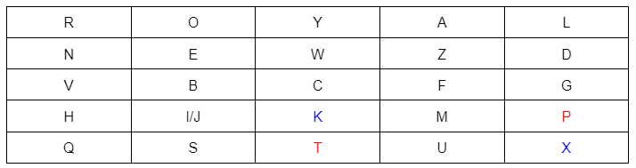

|<p>**Bacharelado em Ciência da Computação** </p><p>**CCMP3079 Segurança de Redes de Computadores** </p><p>**Prof. Sérgio Mendonça** </p><p>**1ª Verificação de Aprendizagem** </p><p>**Para 28/11/2023.**</p>|

**Nome Completo:** Izabel Yale Neves Nascimento

**GitHub:** <https://github.com/izabelnascimento/seguranca-redes-ufape>


**1. Para cada um dos seguintes recursos, determine um nível de impacto baixo, moderado ou alto à perda de confidencialidade, disponibilidade e integridade, respectivamente. Justifique suas respostas.** 

**(a) uma organização gerenciando informações públicas em seu servidor web.** 

- **Confidencialidade (baixo):** pois se tratando de informações públicas não há risco quanto ao acesso indevido por partes não autorizadas, pois é para todo o público.
- **Disponibilidade (moderado):** dependendo do tipo de informação que é fornecida o público de usuários pode ser em larga escala, então se ocorre a indisponibilidade afeta em mesma proporção.
- **Integridade (alto):** como são informações públicas e possivelmente o número de acesso é alto (pensando a nível governamental, CEP por exemplo) é de extrema importância que as informações disponibilizadas sejam confiáveis, pois ocorrendo o contrário há alto risco de prejuízos aos usuários.

**(b) uma organização de aplicação da lei gerindo informações de investigação extremamente sensíveis.** 

- **Confidencialidade (alto):** informações de investigação costumam ser sigilosas e quando se trata de informações sensíveis a questão de confidencialidade deve ser ainda mais reforçada para que os dados não sejam acessados por partes erradas e interfira no caso.
- **Disponibilidade (moderado):** o acesso à informações sensíveis deve ocorrer de maneira cautelosa, assim garantindo os dados estarem nas mãos da pessoa certa em momento adequado.
- **Integridade (alto):** esse tipo de dado não pode sob hipótese alguma sofrer fraude ou modificações indevidas, pois se trata de algo que pode gerar punição baseada em lei.

**(c) uma organização financeira gerindo informações administrativas rotineiras (sem informações relacionadas à privacidade).** 

- **Confidencialidade (moderado):** dependendo do tipo da informação financeira que está se tratando, por exemplo holerites de pagamentos aos funcionários deve ser acessível apenas ao setor administrativo e ao próprio colaborador, porém se tratando de rendimentos da empresa pode ser algo compartilhado com seus funcionários, mas não deve ser aberto ao público de fora.
- **Disponibilidade (moderado):** sendo informações particulares de um indivíduo deve estar disponível sempre que o mesmo necessitar, porém se tratando de informações corporativas depende da organização da empresa.
- **Integridade (alto):** é de extrema importância que não haja alterações em dados financeiros, pois caso ocorra acarretará em prejuízo de contas no final.

**(d) um sistema de informação utilizado para grandes aquisições em uma organização voltada a contratações que contém dados sensíveis da fase de pré-solicitação e dados administrativos rotineiros. avalie o impacto de haver dois conjuntos de dados separadamente e o sistema de informação único.** 

- **Confidencialidade (alto):** por conter dados sensíveis e administrativos o sistema deve manter sua confidencialidade assegurada, pois caso ocorra acesso indevido poderá acarretar em prejuízos à organização.
- **Disponibilidade (moderado):** dados administrativos rotineiros devem estar de fácil acesso ao usuário autorizado, dessa forma facilitando trabalhos constantes realizados com os mesmos.
- **Integridade (alto):** na ocorrência de alguma alteração em dados sensíveis e administrativos poderá acarretar grandes prejuízos morais e organizacionais à corporação.

**(e) uma indústria de energia contém um sistema SCada (controle supervisório e aquisição de dados, do acrônimo em inglês para *supervisory control and data acquisition*) controlando a distribuição da energia elétrica para uma grande instalação militar. o sistema SCada contém tanto sensores de dados em tempo real quanto informações das rotinas administrativas. avalie o impacto de haver dois conjuntos de dados separadamente e o sistema de informação único.** 

- **Confidencialidade (alto):** o controle de acesso às pessoas autorizadas em cada formato dado é de extrema importância principalmente por conter dados sensíveis. Os acessos direcionados exclusivamente a um dos conjuntos de dados deve ser gerido e a intersecção dos autorizados que devem ter acesso ao sistema de informação único.
- **Disponibilidade (alto):** como se trata também de informações de rotina, então é necessário que esses dados sejam disponibilizados de maneira fácil, porém com responsabilidade no acesso.
- **Integridade (alto):** informações sensíveis e administrativas não devem correr risco de sofrer alterações indevidas, caso contrário poderá acarretar em problemas criminosos e organizacionais falando dos tipos de dados respectivamente.


**2. Responda, explique com exemplos, as questões abaixo:** 

**(a) Quais são os elementos essenciais de uma cifra simétrica? Explique-as.** 

- **Texto claro**: mensagem original de entrada;
- **Algoritmo de encriptação**: responsável pelas substituições e confusão do texto claro;
- **Chave secreta**: é o segredo utilizado na criptografia do texto;
- **Texto cifrado**: será o resultado após o uso da chave secreta no algoritmo de encriptação;
- **Algoritmo de decriptação**: é o reverso da criptografia, ou seja, o algoritmo que a partir do texto cifrado e da chave secreta consegue extrair o texto claro.

**(b) Quais são as duas funções básicas usadas nos algoritmos de encriptação? Explique-as.** 

- **Criptografia**: operações que ocorrem em um texto claro que através de um segredo chave e procedimentos realizados produzem um texto final cifrado.
- **Descriptografia**: é o contrário da criptografia, ou seja, através do texto criptografado e a descoberta do segredo chave é possível decifrar o texta, assim extraindo o texto claro original.

**(c) Quantas chaves são necessárias para duas pessoas se comunicarem por meio de uma cifra? Explique-as demonstrando, você pode se utilizar de gráficos ou desenhos.** 

Apenas uma chave é necessária para que duas pessoas se comuniquem através de uma cifra, pois a mesma chave que encripta pode decriptar a mensagem, assim o emissor e o destinatário tendo conhecimento da mesma chave consegue se comunicar através da cifra.

Na imagem podemos observar como ocorre o processo:


**(d) Quais são as duas técnicas gerais para atacar uma cifra? Explique-as.** 

- **Criptoanálise**: faz um estudo analítico do texto cifrado observando padrões e comportamentos comuns da cifra ou de amostras dela e a partir disso tenta deduzir o texto.
- **Ataque por força bruta**: realiza todas as possibilidades de teste exaustivamente até conseguir quebrar a cifra e desvendar o texto.

**(e) Defina resumidamente a cifra de César; a cifra de Hill; a cifra de Feistel (por que é importante estudá-la?); e, a diferença entre DES, Rijndael e AES.** 

- **Cifra de César**: na cifragem cada letra do alfabeto deve ser substituída por outra que fica três posições na frente da original:

  claro A B C D E F G H I J K L M N O P Q R S T U V W X Y Z

cifra: D E F G H I J K L M N O P Q R S T U V W X Y Z A B C

- **Cifra de Hill**: utiliza-se de *‘m’* letras do texto claro e substitui por *‘m’* letras do texto cifrado na fórmula: C = P x K mod 26
  - C -> texto cifrado
  - P -> texto claro
  - K -> chave de encriptação (matriz mxm) 
  - Na execução da cifra o texto claro deve ser separado de m em m, substituindo as letras por números de acordo com a ordem do alfabeto e por últimos aplicado na fórmula. Segue a ordem alfabética:


|**0**|**1**|**2**|**3**|**4**|**5**|**6**|**7**|**8**|**9**|**10**|**11**|**12**|**13**|**14**|**15**|**16**|**17**|**18**|**19**|**20**|**21**|**22**|**23**|**24**|**25**|
| :- | :- | :- | :- | :- | :- | :- | :- | :- | :- | :- | :- | :- | :- | :- | :- | :- | :- | :- | :- | :- | :- | :- | :- | :- | :- |
|**A**|**B**|**C**|**D**|**E**|**F**|**G**|**H**|**I**|**J**|**K**|**L**|**M**|**N**|**O**|**P**|**Q**|**R**|**S**|**T**|**U**|**V**|**W**|**X**|**Y**|**Z**|

- **Cifra de Feistel**: é importante o estudo dela, pois ela aborda conceitos sobre difusão e confusão que são princípios importantes para a criptografia.


- **DES x AES:** para explicar a diferença entre esses dois tipos de cifragem irei comparálas em alguns pontos e destacar suas diferenças.
  - **Segurança**:
    - **DES** é considerado inseguro para aplicações atuais, pois o tamanho da chave é curto;
    - **AES** é considerado seguro e muito utilizado.
  - **Tamanho de chave**: 
    - **DES** usa chaves de 56 bits;
    - **AES** 128, 192 ou 256 bits.
  - **Tamanho de bloco**: 
    - **DES** contém blocos com 64 bits;
    - **AES** 128 bits.
  - **Rounds**: 
    - **DES** 16 rounds
    - **AES** depende da quantidade de bits na chaves:
      - 128 bits, 10 rounds;
      - 192 bits, 12 rounds;
      - 256 bits, 14 rounds. 
- O **Rijndael** é um tipo de cifragem AES, porém com mais flexibilidade nos seus blocos, quantidade de bits, tamanhos de chaves e rounds.

**3. Quando o barco de patrulha norte-americano PT-109, sob o comando do tenente John f. Ken nedy, foi afundado por um destróier japonês, uma mensagem foi recebida na estação sem fio australiana em código playfair:** 

**KXJEY UREBE ZWEHE WRYTU HEYFS** 

**KREHE GOYFI WTTTU OLKSY CAJPO** 

**BOTEI ZONTX BYBNT GONEY CUZWR** 

**GDSON SXBOU YWRHE BAAHY USEDQ** 

**a chave usada foi royal new zealand navy. decripte a mensagem. traduza TT para tt.** 

Chave corrida: royalnewzealandnavy



Para decifrar cada par buscamos na tabela da chave acima a célula onde a linha da primeira letra do par se encontra com a coluna da segunda letra. Em seguida, voltamos na tabela onde a linha da segunda letra do par se encontra com a coluna da primeira letra. Isso deve se repetir para todos os pares.

Na tabela acima pintei o primeiro caso do pas KX -> pt


Texto decifrado corrido:pt bo at on eo we n(i/j) ne lo st in ac t(i/j) on (i/j)n bl ac ke tt st ra it tw om il es sw me re su co ve xc re wo ft we lv ex re qu es ta ny (i/j)n fo rm at (i/j)o nx

Texto claro: “pt boat one owe nine lost in action in blakett strait two miles sw meresu cove x crew of twelve x request any information”

**4. Crie uma aplicação que possa encriptar e decriptar usando uma cifra de Hill 2×2.** 

- **Algoritmo de encriptação**

```
  k = [[9, 4], [5, 7]]
  plaintext = 'meetmeattheusualplaceattenratherthaneightoclockk'
  
  en_alphabet = "abcdefghijklmnopqrstuvwxyz"
  
  def is_alphabetic_char(c):
      return (c.lower() in en_alphabet)
  
  def char_to_num(c):
      return en_alphabet.index(c.lower())
  
  def num_to_char(x):
      return en_alphabet[x % 26]
  
  def encryptHill(k, plaintext):
      ciphertext = ""
      i = 0;
      for j in range(0, len(plaintext), 2):
          p1 = plaintext[j]
          p2 = plaintext[j+1]
          if is_alphabetic_char(p1):
              x1 = (char_to_num(p1))
          if is_alphabetic_char(p2):
              x2 = (char_to_num(p2))
          num1 = (x1*k[0][0] + x2*k[1][0]) % 26
          num2 = (x1*k[0][1] + x2*k[1][1]) % 26
          c1 = num_to_char(num1)
          c2 = num_to_char(num2)
          ciphertext = ciphertext + c1 + c2
      return ciphertext
  
  ciphertext = encryptHill(k, plaintext)
  print(ciphertext)
```

- **Algoritmo de decriptação**

```
  k = matrix([[9, 4], [5, 7]])

  en_alphabet = "abcdefghijklmnopqrstuvwxyz"
  
  def is_alphabetic_char(c):
    return (c.lower() in en_alphabet)
  
  def char_to_num(c):
    return en_alphabet.index(c.lower())
  
  def num_to_char(x):
    return en_alphabet[x % 26]
  
  def decrypHil(k, encrypText):
    ki = k^-1
    plaintext = ""
    for j in range(0, len(encrypText), 2):
      c1 = encrypText[j]
      c2 = encrypText[j+1]
      if is_alphabetic_char(c1):
        x1 = (char_to_num(c1))
      if is_alphabetic_char(c2):
        x2 = (char_to_num(c2))
      num1 = (x1*ki[0][0] + x2*ki[1][0]) % 26
      num2 = (x1*ki[0][1] + x2*ki[1][1]) % 26
      c1 = num_to_char(num1)
      c2 = num_to_char(num2)
      plaintext = plaintext + c1 + c2
    return plaintext
  plaintext = decrypHil(k, "" )
  print(plaintext)
```

**5. Responda, resumidamente, as questões a seguir:** 

**(a) Qual é a diferença entre uma cifra de bloco e uma cifra de fluxo?** 

Uma cifra de fluxo encripta os dados em fluxo, ou seja, um bit ou byte por vez. Já a cifra de bloco encripta um bloco do texto claro por vez, o bloco é tratado como o todo e é cifrado com o mesmo tamanho de caracteres.

**(b) O que é uma cifra de produto?** 

`	`É a execução de duas ou mais cifras simples uma seguida da outra, assim o resultado do produto, ou seja, do texto cifrado, é mais forte.

**(c) Qual é a diferença entre difusão e confusão? Explique.** 
**
`	`Na difusão cada dígito do texto claro faz muita diferença no texto cifrado, então caso haja modificação em um caractere apenas do texto claro, o texto cifrado muda consideravelmente. 

Já a confusão procura deixar o mais complexo possível o valor da chave de encriptação e o texto cifrado, assim dificultando a descoberta da chave.

**(d) Quais parâmetros e escolhas de projeto determinam o algoritmo real de uma cifra de Feistel?**

- Tamanho do bloco;
- Tamanho da chave;
- Número de rodadas;
- Algoritmo de geração da subchave;
- Função F;

**(e) Explique o efeito avalanche.** 

É uma propriedade que uma pequena mudança no texto claro ou na chave produz uma alteração significativa no texto cifrado. Esse efeito é uma característica do DES. Uma mudança em um bit do texto claro ou um bit da chave deverá produzir uma modificação em muitos bits do texto cifrado.

<b>6. Encontre o inverso multiplicativo de cada elemento diferente de zero em <i>Z</i><sub>5</sub>.</b>

Na definição de anel infinito encontra-se o inverso multiplicativo b de um elemento a quando:

ab congruente 1 mod n. Como está sendo pedido para Z5, então n=5:

```
1 \* 1 mod 5 = 1
2 \* 3 mod 5 = 1
3 \* 2 mod 5 = 1
4 \* 4 mod 5 = 1

{1, 2, 3, 4}
```

<b>7. Para a aritmética de polinômios com coeficientes em <i>Z</i><sub>10</sub>, realize os seguintes cálculos:</b> 

<b>1. (7<i>x</i> + 2) <i>−</i> (<i>x</i><sup>2</sup> + 5)</b>
```
= 7x + 2 - x^2 - 5
= -x^2 + 7x - 3
```

<b>2. (6<i>x</i><sup>2</sup> + <i>x</i> + 3) <i>×</i> (5<i>x</i><sup>2</sup> + 2)</b> 
```
= 30x^4 + 12x^2 + 5x^3 + 2x + 15x^2 + 6
= 30x^4 + 5x^3 + 27x^2 + 2x + 6
```

**8. Use a chave 1010 0111 0011 1011 para encriptar o texto claro "ok"conforme expresso em ASCII, ou seja, 0110 1111 0110 1011. Os projetistas do S-AES obtiveram o texto cifrado 0000 0111 0011 1000. E você?** 

O S-AES utiliza do mesmo algoritmo do AES, porém mais simplificado. A principal diferença é que na simplificação a chave utilizada contém 16 bits, o número de rodadas é 2 e na segunda rodada não deve ocorrer o Mix Columns, como mostra a figura:


Utilizando a chave 1010 0111 0011 1011 para encriptar 0110 1111 0110 101 (ok), segue a utilização do S-AES:


**9. Compare AES com DES. Para cada um dos seguintes elementos do DES, indique o elemento comparável no AES ou explique por que ele não é necessário no AES.** 

**(a) XOR do material da subchave com a entrada da função f.** 

- **DES**: as subchaves são derivadas da principal usando permutações e rotações. Antes de ser usada na rodada, as subchaves são expandidas e combinadas com a metade direita do bloco por XOR.
- **AES**: cada subchave de rodada deriva diretamente da chave principal. A adição de subchaves acontece por XOR com cada palavra de estado em cada rodada.

**(b) XOR da saída da função f com a metade esquerda do bloco.** 

- **DES**: depois que ocorre a função F, antes de seguir para a rodada seguinte, a saída é combinada por XOR com a metade esquerda do bloco.
- **AES**: a saída da função de mixColumns é combinada com o estado por XOR antes de passar para a próxima rodada.

**(c) função f.** 

- **DES**: a função F envolve expansão, permutações, substituições e XORs para misturar os dados.
- **AES**: a função MixColumns parecida com a função F, envolve operações para combinar estados.

**(d) permutação P.** 

- **DES**: a permutação P é usada no final da função F misturando bits.
- **AES**: não há uma permutação P específica. A mistura e difusão são alcançadas por meio de várias operações, incluindo ShiftRows e MixColumns.

**(e) troca de metades do bloco.** 

- **DES**: após cada rodada, as metades esquerda e direita do bloco são trocadas.
- **AES**: ao invés de troca específica das metades do bloco, o estado é manipulado com operações específicas em cada rodada.

**10. Calcule a saída da transformação MixColumns para a seguinte sequência de bytes de entrada "67 89 AB CD". Aplique a transformação InvMixColumns ao resultado obtido para verificar seus cálculos. Altere o primeiro byte da entrada de "67"para "77", realize a transformação MixColumns novamente para a nova entrada e determine quantos bits mudaram na saída.** 

**Nota: você pode realizar todos os cálculos à mão ou escrever um programa que dê suporte a eles. Se escolher escrever um programa, ele deverá ser feito inteiramente por você; nesta tarefa, não use bibliotecas ou código fonte de domínio público (você pode se guiar pelos exemplos Sage disponibilizados).** 

Na resposta final mudaram 5 bits da saída 67 para 77.


