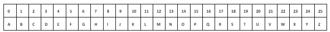

|<p>**Bacharelado em Ciência da Computação**</p><p>**CCMP3079 Segurança de Redes de Computadores**</p><p></p><p>**Prof. Sérgio Mendonça**</p><p>**Atividade Cap. 02**</p><p>**Para 17/10/2023**</p>|

**Nome Completo:** 

- Izabel Yale Neves Nascimento
- Jonas Ferreira Leal Junior

1. **Responda (de forma objetiva) as questões a seguir:**
   1) **Quais são os elementos essenciais de uma cifra simétrica?**
      
      Texto claro, algoritmo de encriptação, chave secreta, texto cifrado e algoritmo de decriptação

   2) **Quais são as duas funções básicas usadas nos algoritmos de encriptação?**

      Criptografia e descriptografia

   3) **Qual é a diferença entre uma cifra de bloco e uma cifra de fluxo?**

      A cifra de bloco processa os elementos de entrada de um bloco de uma vez e retorna uma saída para cada bloco de entrada, já a cifra de fluxo processa de maneira contínua tendo uma saída de elemento por vez.

   4) **Quais são as duas técnicas gerais para atacar uma cifra?**
      - Criptoanálise: através de uma análise estratégica do texto claro, em partes ou completo, consegue extrair uma lógica para dedução da cifra.
      - Ataque por força bruta: quando a decriptação ocorre por tentativa e erro das possibilidades de cifra.
   
   5) **Quais são os dois problemas com o one-time pad?**
      - Tamanho da chave: para maior confiabilidade essa cifra requer que a criptografia seja muito longa, proporcional ao da mensagem criptografada. Isso acarreta em problemas no transporte e armazenamento da cifra.
      - Reutilização da chave: não é possível a reutilização de uma mesma chave, pois cada uma é gerada para criptografar uma mensagem específica.
   
   6) **O que é uma cifra de transposição?**

      É um tipo de cifra que utiliza de permutação nos caracteres do texto claro. Essa permutação utilizada pode variar de tipo, como por exemplo, trocar linhas por colunas.

   7) **O que é esteganografia?**

      É uma técnica para esconder mensagens dentro de um texto aparentemente comum, porém possui alguma característica que quando desvendada revela a mensagem escondida, por exemplo, a primeira palavra de cada parágrafo do texto quando juntas revelam a mensagem real.

#

2. **Uma generalização da cifra de César, conhecida como cifra de César afim, tem a seguinte forma: a cada letra de texto claro p, substitua-a pela letra de texto cifrado C:
   C = E([a,b],p) = (ap + b)	mod 26
   Um requisito básico de qualquer algoritmo de encriptação é que ele seja um para um. Ou seja, se p ̸= q, então E(k,p) ̸= E(k,q). Caso contrário, a decriptação é impossível, pois mais de um caractere de texto claro é mapeado no mesmo caractere de texto cifrado. A cifra de César afim não é um-para-um para todos os valores de a. Por exemplo, para a = 2 e b = 3, então E([a,b],0) = E([a,b],13) = 3.**
   1) **existem limitações sobre o valor de b? explique por que sim ou por que não.**

      Como o mod 26 para essa cifra, então b deve ser coprimo de 26, ou seja, deve ser um valor que que não tenha fator comum com 26, com exceção do 1, para assim o mapeamento não haver repetições.

   2) **determine quais valores de a não são permitidos.**

      Já a é o contrário, sua restrição é sobre não ser coprimo de 26, então todo valor que tiver fator comum com 26 com exceção do 1 é permitido para a.

   3) **ofereça uma afirmação geral sobre quais valores de a são e não são permitidos. Justifique-a.**

      - Valores permitidos para ‘a’ são os coprimos com 26, aqueles que não tem fatores comum com 26 exceto 1. 
      - Valores permitidos para ‘b’ são os que possuem fator comum com 26. 
      - Essas restrições são aplicadas para que a cifra atenda sua característica de um para um, se a puder ter fator comum com 26 pode gerar uma repetição no mapeamento, o mesmo se aplica para b.

3. **(a) Encripte a mensagem “meet me at the usual place at ten rather than eight oclock” usando a cifra de Hill com a chave . Mostre seus cálculos e o resultado.**

   
   - Mensagem Criptografada: yybtyyrdyvgacedzihkokqgbxdxqyvrfyvnnyulvhsvhgskg

   

   **(b) Mostre os cálculos para a decriptação correspondente do texto cifrado a fim de recuperar o texto claro original.**
      - Para decriptação é necessário encontrar a matriz inversa da chave, K^(-1)
      - O primeiro passo é encontrar o determinante, como se trata de uma matriz 2x2 então o det=ad-bc. Então:
      ```
        det = 9\*7 - 4\*5 = 63 - 20
        det=43
      ```
      Logo após deve ser aplicada essa matriz na cifragem para decriptar.

4. **Elabore um programa que possa encriptar e decriptar usando a cifra de César geral, também conhecida como cifra aditiva.**

   ```
   def CaesarEncrypt(k, plaintext):
    ciphertext = ""
    for j in range(len(plaintext)):
        p = plaintext[j]
        if is_alphabetic_char(p):
            x = (k + char_to_num(p)) % 26
            c = num_to_char(x)
        else:
            c = p
        ciphertext += c
    return ciphertext
   ```
   ```
   def CaesarDecrypt(k, ciphertext):
    plaintext = ""
    for j in range(len(ciphertext)):
        c = ciphertext[j]
        if is_alphabetic_char(c):
            x = (char_to_num(c) - k) % 26
            p = num_to_char(x)
        else:
            p = c
        plaintext += p
    return plaintext
   ```
   

5. **Elabore um programa que possa realizar um ataque de frequência de letra em uma cifra aditiva sem intervenção humana. Seu software deverá produzir textos claros possíveis em ordem aproximada de probabilidade. Seria bom se a sua interface com o usuário permitisse que ele especificasse “mostre os 10 textos claros mais prováveis”.**

   ```
   def BruteForceAttack(ciphertext, keyword=None):
    for k in range(26):
        plaintext = CaesarDecrypt(k, ciphertext)
        if (None==keyword) or (keyword in plaintext):
            print("key", k, "decryption", plaintext)
    return
   ```

6**Crie um software que possa encriptar e decriptar usando uma cifra de Hill 2 × 2.**

- **Algoritmo de encriptação**

```
  k = [[9, 4], [5, 7]]
  plaintext = 'meetmeattheusualplaceattenratherthaneightoclockk'
  
  en_alphabet = "abcdefghijklmnopqrstuvwxyz"
  
  def is_alphabetic_char(c):
      return (c.lower() in en_alphabet)
  
  def char_to_num(c):
      return en_alphabet.index(c.lower())
  
  def num_to_char(x):
      return en_alphabet[x % 26]
  
  def encryptHill(k, plaintext):
      ciphertext = ""
      i = 0;
      for j in range(0, len(plaintext), 2):
          p1 = plaintext[j]
          p2 = plaintext[j+1]
          if is_alphabetic_char(p1):
              x1 = (char_to_num(p1))
          if is_alphabetic_char(p2):
              x2 = (char_to_num(p2))
          num1 = (x1*k[0][0] + x2*k[1][0]) % 26
          num2 = (x1*k[0][1] + x2*k[1][1]) % 26
          c1 = num_to_char(num1)
          c2 = num_to_char(num2)
          ciphertext = ciphertext + c1 + c2
      return ciphertext
  
  ciphertext = encryptHill(k, plaintext)
  print(ciphertext)
```

- **Algoritmo de decriptação**

```
  k = matrix([[9, 4], [5, 7]])

  en_alphabet = "abcdefghijklmnopqrstuvwxyz"
  
  def is_alphabetic_char(c):
    return (c.lower() in en_alphabet)
  
  def char_to_num(c):
    return en_alphabet.index(c.lower())
  
  def num_to_char(x):
    return en_alphabet[x % 26]
  
  def decrypHil(k, encrypText):
    ki = k^-1
    plaintext = ""
    for j in range(0, len(encrypText), 2):
      c1 = encrypText[j]
      c2 = encrypText[j+1]
      if is_alphabetic_char(c1):
        x1 = (char_to_num(c1))
      if is_alphabetic_char(c2):
        x2 = (char_to_num(c2))
      num1 = (x1*ki[0][0] + x2*ki[1][0]) % 26
      num2 = (x1*ki[0][1] + x2*ki[1][1]) % 26
      c1 = num_to_char(num1)
      c2 = num_to_char(num2)
      plaintext = plaintext + c1 + c2
    return plaintext
  plaintext = decrypHil(k, "" )
  print(plaintext)
```