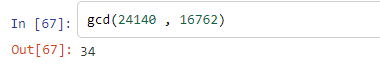

|
**Bacharelado em Ciência da Computação** 

**CCMP3079 Segurança de Redes de Computadores** 

**Prof. Sérgio Mendonça** 

**Atividade Cap. 04 - Conceitos básicos de Teoria dos Números e Corpos Finitos Para apresentação e discussão em sala de aula, em 31/10/2023.**
|

**Nome Completo:** 

- Izabel Yale Neves Nascimento
- Jonas Ferreira Leal Junior

**1. Defina resumidamente, um grupo, um anel, um corpo.** 

- **Grupos:** Conjunto de elementos que possui uma operação de combinação entre dois elementos quaisquer, formando um terceiro elemento. Deve obedecer aos axiomas de A1 a A5.
- **Anéis:** São grupos com duas operações binárias, adição e multiplicação, que obedecem aos axiomas de A1 a A5 e M1 a M6.
- **Corpos:** É um conjunto que é possível somar, subtrair, multiplicar e dividir por números não nulos e que satisfazem os axiomas de A1 a A5 e M1 a M7.

**2. O que significa dizer que *b* é um divisor de *a*?**
    
- "b" divide "a" se "a" e "b" são inteiros, "b != 0" e o resultado não terá resto.

**3. Para cada uma das seguintes equações, encontre um inteiro *x* que satisfaça:** 

**(a) 5*x ≡* 4 (mod 3)**   
X = 2

**(b) 7*x ≡* 6 (mod 5)**    
X = 3

**(c) 9*x ≡* 8 (mod 7)**  
X= 9

**4. Encontre o inverso multiplicativo de cada elemento diferente de zero em <i>Z</i>5.**

    0  não tem
    1  \* 1 mod 5 = 1
    2 \* 3 mod 5 = 1
    3 \* 2 mod 5 = 1
    4 \* 4 mod 5 = 1

**5. Determine os MDC:** 

**(a) mdc(24140, 16762):**  

**(b) mdc(4655, 12075).** 

**6. Usando o algoritmo de Euclides estendido, encontre o inverso multiplicativo de:** 

**(a) 1234 mod 4321;** 

**(b) 24140 mod 40902;** 

**(c) 550 mod 1769.** 

**7. Determine o inverso multiplicativo de <i>x</i>3 + <i>x</i> + 1 em GF(24), com <i>m</i>(<i>x</i>) = <i>x</i>4 + <i>x</i> + 1.** 

**8. Para a aritmética de polinômios com coeficientes em <i>Z</i>10, realize os seguintes cálculos:**

<b>(a) (7<i>x</i> + 2) <i>−</i> (<i>x</i>2 + 5)</b> 

    = 7x + 2 -x² -5
    = -x² + 7x - 3

<b>(b) (6<i>x</i>2 + <i>x</i> + 3) <i>×</i> (5<i>x</i>2 + 2)</b>

    =30x4 + 12x² + 5x³ + 2x + 15x² + 6
    =30x4 + 5x³ + 27x² + 2x + 6

**9. Estruture uma calculadora simples de quatro funções em GF(24). Você pode usar uma tabela com valores pré-calculados para os inversos multiplicativos.**
